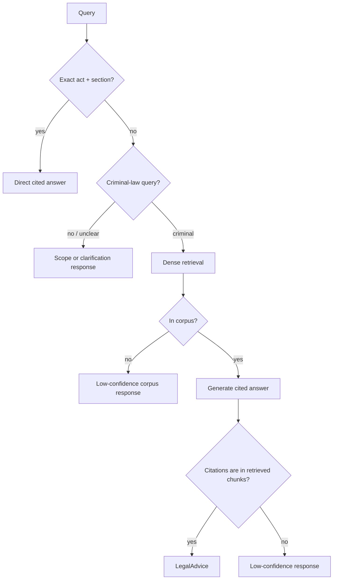

# ⚖️ Agentic Legal RAG: Indian Criminal Law (BNS / BNSS / BSA)

> A retrieval-augmented question-answering system for Indian criminal law, and a record of what I learned building it. The live path uses dense retrieval and a deterministic citation check. The larger self-correcting agent I built first is kept for comparison, because measuring it against the simpler path is part of the story.

> ⚠️ Statutory information, not legal advice. Not a substitute for a lawyer.

> 🚧 **Status:** the live path, API, and Streamlit client are complete. The 12-node self-correcting graph is retained as an experiment rather than the default, for reasons the evaluation section explains. Docker packaging is deliberately deferred. See `NOTES.md` for the locked decisions and `PROJECT.md` for the week-by-week build log.

---

## Why I built this

Indian legal RAG is a crowded space (LexGrid, NYAYA.ai, Legal Assist AI, BNS Mitra, and others). Rather than add another chatbot, I wanted to build something I could actually check: statute-aware retrieval, direct section lookup, a citation check written in code, and an evaluation record honest enough to include its own negative results.

The 2023–2024 legal transition gave the project a concrete reason to exist. The IPC, CrPC, and Evidence Act were replaced by the BNS, BNSS, and BSA, and general-purpose LLMs still answer with the *repealed* IPC sections. This system carries an IPC→BNS mapping and answers in the new code.

What I did not expect going in was how much of the work would be about *removing* machinery rather than adding it. The short version: I built the full self-correcting agent the literature recommends, measured it honestly, and found that its safety loop was hurting answer quality more than helping. The live system is the simpler thing that measurement pointed me toward. The sections below trace that path.

## Architecture



The live graph has no rewrite loop. The older full graph, with intent expansion, relevance grading, a faithfulness checker, and query rewriting, is still selectable for evaluation.

## What building this taught me

Four decisions changed my mind mid-project. Each one started as an assumption I inherited from tutorials or papers, and each one was overturned by a measurement.

**More agent machinery is not automatically better.** My first design was the textbook self-correcting agent: a router, an intent expander, an eight-way parallel relevance grader, a generator, a deterministic citation validator, an LLM faithfulness checker, and a rewrite loop feeding failures back for another attempt. It runs, and every node does what it was designed to do. But when I ran RAGAS over 50 scenarios, faithfulness sat at 0.309 and answer relevancy at 0.518. Reading the traces showed why. The checker kept rejecting answers that had already passed the deterministic citation check, the rewrite loop usually retrieved similar text and failed again, and 13 to 20 scenarios ended in a canned "low confidence" reply that scores as zero. When I stripped the checker and rewrite loop out and re-ran the same 50 scenarios on the simple path, faithfulness rose to 0.517 and answer relevancy to 0.749. Removing two components nearly doubled two of my headline numbers. The lesson I took from this is to treat every agent node as a claim that has to earn its place in a measurement, not as free safety.

**Chunking is a retrieval decision, not preprocessing.** An early diagnostic on the query "someone took my bicycle" kept failing, and the cause turned out to be BNS section 303. Semantic chunking had shredded it into 18 fragments, and the base-punishment sentence was cut across a chunk boundary, so no single chunk contained the complete clause. The generator could not ground the punishment and correctly refused. I fixed the root cause in the shared chunker rather than special-casing one section: semantic fragments are rejoined into complete sentences before being repacked into the 512-token budget. BNS 303 went from 18 fragments to 4, and the whole corpus dropped from 1,762 chunks to 1,151. For structured legal text where a single sentence carries the operative rule, how you split matters as much as how you retrieve.

**Ablate your defaults, including the ones everyone uses.** Hybrid retrieval with a cross-encoder reranker is the standard recommendation, so I built it that way and treated it as settled. On the rebuilt corpus, dense-only retrieval beat it: Recall@5 of 0.750 against 0.630, and MRR of 0.706 against 0.422. The reranker turned out to be a trade rather than a win. It pulls more relevant sections into the top 5 but demotes the single best exact match, which BM25 had usually placed first. Once I could measure it, the "obvious" default was the weaker choice.

**The piece I trust most is the one written in code.** Telling a model to cite sources only changes the shape of its answer. The deterministic citation validator checks, in plain Python, that every cited section actually appears in the retrieved set. It is the component I am most confident in and the one most systems skip, precisely because it is not an LLM and cannot be talked out of a rejection.

## Key features

- **Deterministic citation validator.** Every cited `[Section, Act]` is verified against the retrieved set in code, not by a model.
- **Exact-section fast path.** `"BNS 103"` and `"302 IPC"` resolve through a direct metadata lookup in well under the 50 ms target, skipping both embedding and the LLM, with IPC references bridged to their BNS equivalents. The lookup also surfaces the enriched cognizable, bailable, and offence-category flags it already holds.
- **Dense retrieval.** The default is the highest-scoring dense-only configuration, with no reranker and a 12-chunk answer context.
- **IPC→BNS bridge.** Answers old-code references in the current statute, which is where general LLMs still go wrong.
- **Experimental full graph.** Intent expansion, grading, checking, and rewriting remain available for reproducible comparisons.
- **Auditable by design.** Answers carry structured citations and can include a LangSmith trace URL when tracing is configured.

## Competitor comparison

The comparison below summarizes the systems I reviewed while scoping the project. Reported metrics use each project's own setup, so they are context rather than a leaderboard.

| System | Retrieval and agent loop | Grounding check | Reported evaluation |
|---|---|---|---|
| **This project** | Dense live path; legacy LangGraph rewrite loop for comparison | Deterministic cited-section membership check | 50-scenario retrieval set; three RAGAS-50 runs; 60-question BhashaBench-Legal sample |
| **LexGrid** | Hybrid ANN + full-text RRF, reranking, exact-section bypass; single-shot | Citation format and distance threshold | 12-case suite: MRR 0.833, Recall@5 0.814, P@5 0.233, legal accuracy 0.703 |
| **Legal Assist AI** | Dense FAISS retrieval with a prompt-based guardrail; single-shot | “I don't know” guardrail | AIBE 60.08%; BERTScore 76.9% |
| **Indian Criminal Law RAG Agent** | Dense top-5 retrieval with a three-agent CrewAI loop | LLM grounding assessment | 20-query human evaluation: 85–90% top-5 relevance, 92% grounding |

The intended contribution is not a novel component. It is the combination of statute-aware retrieval, a deterministic citation check, and failure cases I actually report.

## Evaluation

Every number below is labeled with the model that produced it. Historical runs stay labeled with their original model, and current work uses DeepSeek. Auditability is a first-class goal here, so the evaluation record stays honest about provenance and keeps its negative results.

### Retrieval (pure, model-agnostic, no LLM)

Post-repair baseline over the 50-scenario labeled set (`data/eval/scenarios.jsonl`, 19 easy / 24 medium / 7 hard, 66 distinct BNS sections; every labeled section was verified to exist in the corpus before it entered the set). All rows use the rebuilt 1,151-chunk corpus:

| config | P@5 | Recall@5 | MRR |
|---|---|---|---|
| BM25 only | 0.080 | 0.330 | 0.327 |
| dense only | **0.200** | **0.750** | **0.706** |
| hybrid RRF | 0.132 | 0.527 | 0.508 |
| dense + reranker | 0.176 | 0.693 | 0.456 |
| hybrid + reranker (legacy agent) | 0.164 | 0.630 | 0.422 |

The rebuilt corpus overturned my original hybrid assumption. Dense-only wins this retrieval-only set, and dense + reranker also beats hybrid + reranker. The node-level ablation and manual audit below both support dense without reranking as the live path. P@5 is low by construction, because most scenarios have one to three relevant sections, which caps a perfect single-answer at 0.20.

### RAGAS (real generative task: DeepSeek Flash judge / Flash control nodes / Pro generator)

All runs use a DeepSeek Flash judge with local BGE-small embeddings, Flash control nodes, and a Pro final generator. The first two rows are the older full self-correcting graph. The third is the **current live production path**: dense retrieval, generation, deterministic citation validation, and the scope and out-of-corpus controls, with no grader, checker, or rewrite loop.

| pipeline / retrieval | faithfulness | answer relevancy | context precision | context recall |
|---|---:|---:|---:|---:|
| full graph, dense, no reranker | 0.309 | 0.518 | 0.700 | 0.840 |
| full graph, hybrid RRF + reranker | 0.314 | 0.386 | **0.709** | 0.732 |
| **production, dense, no reranker** | **0.517** | **0.749** | 0.615 | **0.919** |

Removing the checker and rewrite loop nearly doubled faithfulness (0.309 → 0.517) and answer relevancy (0.518 → 0.749) and lifted context recall to 0.919. Context precision dips (0.700 → 0.615) with the wider 12-chunk answer window. All 50 production scenarios returned a generated answer, and none fell back to the canned low-confidence reply that ended 13 to 20 scenarios in the full-graph runs. The 20-case node ablation and the ten-answer statute audit predicted this result, and the full production run confirmed it. Faithfulness at 0.517 is still middling, so this remains a local demo rather than a legal-answer service. See [the complete RAGAS record](docs/ragas-50-results.md).

### MCQ external comparability: BhashaBench-Legal criminal slice (Cerebras `gpt-oss-120b`)

I originally planned to use the AIBE dataset, but its honestly-answerable IPC slice was only about 6 to 15 questions, too thin to headline (the reasoning is in `NOTES.md`). `bharatgenai/BhashaBench-Legal` gives a real slice: 1,825 criminal-law MCQs, of which 579 cite repealed IPC, so the IPC→BNS bridge gets a proper external validation set. On a stratified 60-question sample (29 bridge-inclusive) against a no-RAG baseline:

| tier | accuracy |
|---|---|
| system (RAG) | 0.717 |
| no-RAG baseline | 0.683 |
| bridge subset (29 Qs) | 0.724 vs 0.690 baseline |

**Directional only, within noise.** With n=60, the overall +0.033 is roughly two questions and the bridge +0.034 is one. It shows that naive retrieve-then-pick is not hurting on this model and sample, which is not a significance claim. This is the naive MCQ path, not the full agent, and it is not cross-compared to any other model's number, because a different model or sample would make the comparison dishonest.

### Ablations

The dense, sparse, hybrid, and reranked retrieval rows are quantified above. I also ran a budget-limited node ablation on a fixed, stratified random 20-scenario sample, using dense retrieval without reranking, DeepSeek V4 Flash for control and judging, and V4 Pro for answers.

| pipeline | faithfulness | answer relevancy | context precision | context recall |
|---|---:|---:|---:|---:|
| baseline | **0.433** | **0.718** | 0.737 | 0.796 |
| baseline + grader | 0.426 | 0.714 | **0.844** | 0.823 |
| baseline + grader + checker | 0.186 | 0.310 | 0.789 | 0.794 |
| current full graph | 0.341 | 0.501 | 0.778 | **0.892** |

This ablation is what convinced me to simplify. The plain baseline has the best answer-level scores. The grader improves context quality, but its answer-level effect is small and it costs eight extra Flash calls per query. The checker and rewrite loop add recall while reducing grounding and relevance on this sample. It is a 20-case diagnostic rather than a headline score, but the direction was clear, and the ten-answer statute audit agreed: the full graph produced five generic low-confidence replies after rejecting citation-valid answers, while the simple path answered all ten (five fully supported, five partial, with one partial answer misstating a sentence, now covered by a regression test). See [the complete RAGAS record](docs/ragas-50-results.md) and [the manual answer audit](docs/manual-answer-audit.md).

### A failure handled safely

The citation validator has a deterministic regression test for a high-risk failure. An answer that cites BNS 307 when only BNS 306 was retrieved is rejected before it can be returned. The graph then rewrites and retrieves again, or returns low confidence once its two-attempt budget is spent. This is the behavior I most wanted to be able to demonstrate, and it runs without an LLM.

## Local setup

Docker packaging is deferred. Place the source PDFs named in Data & licensing under `data/raw/`. The command below regenerates the git-ignored corpus artifacts under `data/processed/`.

```bash
cp .env.example .env        # fill in DEEPSEEK_API_KEY, LANGSMITH_API_KEY, HF_TOKEN
uv sync --all-extras
uv run python -m src.retrieval.index
uv run uvicorn src.api.main:app --reload
# in another terminal:
uv run streamlit run frontend/app.py
```

API: `http://localhost:8000` · Frontend: `http://localhost:8501`

## Current limitations

- Docker packaging is deferred.
- Production RAGAS-50 answer relevancy is decent (0.749), but faithfulness is still middling (0.517), so this remains a local demo rather than a legal-advice service.

## Data & licensing

- **Corpus:** BNS / BNSS / BSA bare-act PDFs in `data/raw/` (not committed, Govt-of-India copyright, ingested for retrieval and evaluation, not redistributed). Source the enacted acts from **[India Code](https://indiacode.nic.in)**, the official portal: Bharatiya Nyaya Sanhita 2023 (Act 45, **358 sections**), Bharatiya Nagarik Suraksha Sanhita 2023 (Act 46, **531 sections**), Bharatiya Sakshya Adhiniyam 2023 (Act 47, **170 sections**). Save them as `bns.pdf`, `bnss.pdf`, `bsa.pdf`. The parser verifies each parsed section count against these published totals, and all three land exactly. The **IPC→BNS / CrPC→BNSS / Evidence→BSA** correspondence tables, used for the old-code bridge, come from the MHA "three new criminal laws" comparison summaries. Save the BNS↔IPC one as `COMPARISON SUMMARY BNS to IPC .pdf`. The cognizable and bailable flags are parsed from the BNSS First Schedule.
- **Eval dataset** (gated, needs `HF_TOKEN`):
  - `bharatgenai/BhashaBench-Legal`: **CC BY-4.0**, the criminal-law slice (1,825 MCQs) used for external comparability. An earlier plan to use `opennyaiorg/aibe_dataset` was dropped because its honestly-answerable IPC slice was too thin to headline (see `NOTES.md`).

## Governance & security

- **Auditable by design:** structured citations, with LangSmith trace links when tracing is configured.
- ⚠️ **No auth on the API.** Fine for a local demo, but it must sit behind an API key or gateway before any public or cloud deployment.

## Project layout

See `NOTES.md` for the annotated tree and the coding rules.

## Further reading

- [Why naive RAG fails on Indian criminal-law text](docs/why-naive-rag-fails.md)

## License

MIT (code). Eval datasets retain their own licenses (see above).
