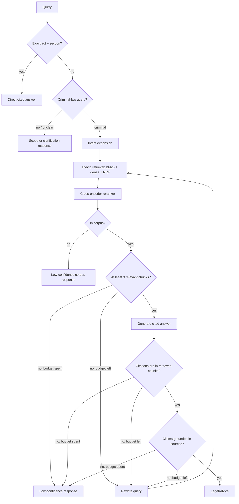

# ⚖️ Agentic Legal RAG: Indian Criminal Law (BNS / BNSS / BSA)

> An agentic, self-correcting RAG system for Indian criminal law. Hybrid retrieval, a deterministic citation validator (the anti-hallucination step most systems skip), and dual evaluation (RAGAS diagnostics on the real task plus a BhashaBench-Legal external-comparability number), with a small lint-and-test CI check.

> ⚠️ Statutory information, not legal advice. Not a substitute for a lawyer.

> 🚧 **Status:** the 12-node pipeline, API, and Streamlit client are complete. Docker packaging is deliberately deferred; see Local setup for the currently supported path. See `NOTES.md` for locked decisions and `PROJECT.md` for the build plan.

---

## Why this exists

Indian legal RAG is a crowded niche (LexGrid, NYAYA.ai, Legal Assist AI, BNS Mitra, and others). What I didn't see combined in one project was the full stack: agentic self-correction, hybrid retrieval, deterministic citation validation, and dual evaluation. Getting that convergence into one system is the point here.

The 2023 to 2024 IPC/BNS transition also created a live pain point: generalist LLMs still cite *repealed* IPC sections. This system carries an IPC-to-BNS mapping and answers in the new code.

## Architecture



The graph allows at most two rewrite-and-retrieve iterations. It returns a low-confidence
response rather than continuing indefinitely.

## Key features

- **Deterministic citation validator:** every cited `[Section, Act]` is verified to exist in the retrieved set (pure code, not an LLM). This is the part I think sets it apart, and it's what drives the self-correction loop.
- **Exact-section fast path:** `"BNS 103"` / `"302 IPC"` resolve via direct metadata lookup, with IPC references bridged to BNS.
- **Hybrid retrieval:** BM25 + dense + RRF (k=60), cross-encoder reranker on by default.
- **Intent expansion:** one messy narrative into parallel offence sub-queries (cross-sectional reasoning).
- **Auditable by design:** answers carry structured citations and can include a LangSmith trace URL when tracing is configured.

## Competitor comparison

The comparison below summarizes the systems reviewed during project scoping. Reported
metrics use each project's own setup, so they are context rather than a leaderboard.

| System | Retrieval and agent loop | Grounding check | Reported evaluation |
|---|---|---|---|
| **This project** | BM25 + dense RRF, reranking, and a LangGraph rewrite loop | Deterministic cited-section membership check, then claim grounding check | 50-scenario retrieval set; 3-scenario RAGAS diagnostic; 60-question BhashaBench-Legal sample |
| **LexGrid** | Hybrid ANN + full-text RRF, reranking, exact-section bypass; single-shot | Citation format and distance threshold | 12-case suite: MRR 0.833, Recall@5 0.814, P@5 0.233, legal accuracy 0.703 |
| **Legal Assist AI** | Dense FAISS retrieval with a prompt-based guardrail; single-shot | “I don't know” guardrail | AIBE 60.08%; BERTScore 76.9% |
| **Indian Criminal Law RAG Agent** | Dense top-5 retrieval with a three-agent CrewAI loop | LLM grounding assessment | 20-query human evaluation: 85–90% top-5 relevance, 92% grounding |

The intended difference is not that any single component is novel. It is the combination of
hybrid retrieval, bounded self-correction, deterministic citation validation, and reported
failure cases.

## Evaluation

Every number below is labeled with the model that produced it. Historical runs stay labeled
with their actual model; current development and future runs use DeepSeek. Auditability is a
first-class goal here, so the eval record stays honest about provenance.

### Retrieval (pure, model-agnostic — no LLM)

Frozen pre-tuning baseline over the 50-scenario labeled set (`data/eval/scenarios.jsonl`,
19 easy / 24 medium / 7 hard, 66 distinct BNS sections; every labeled section verified to
exist in the corpus before it enters the set):

| config | P@5 | Recall@5 | MRR |
|---|---|---|---|
| hybrid only | 0.148 | 0.550 | **0.500** |
| hybrid + reranker (default) | 0.170 | **0.653** | 0.413 |

The reranker is a **recall-vs-rank trade, not a free win**: the cross-encoder pulls ~10 pts
more relevant sections into the top-5 (recall — the metric that matters most for "don't miss
an applicable offence") but demotes the single best result on average (MRR −0.087). Kept on
by default because breadth beats peak-rank for this domain and the grader re-sorts downstream,
but the MRR cost is documented, not buried. (P@5 is low by construction — most scenarios have
1–3 relevant sections, capping a perfect single-answer at 0.20; Recall@5 and MRR are the
honest signals.)

### RAGAS (real generative task — DeepSeek `deepseek-v4-pro` grader / `deepseek-v4-flash` nodes)

On a 3-scenario slice, the deterministic pipeline behaved exactly as designed, and the result
is a finding worth more than a headline metric:

| metric | value | reading |
|---|---|---|
| context_precision | **0.94–1.0** | retrieval ranks the right sections at the top |
| context_recall | **0.60–0.65** | valid; per-difficulty easy/medium/hard signal intact |
| faithfulness | **0.0** | the anti-hallucination checker **refused** an ungrounded answer |

The faithfulness `0.0` is **not the system hallucinating — it is the opposite.** For "someone
stole my bike," the generator padded BNS 303's base punishment beyond the retrieved text; the
hallucination checker caught the ungrounded claim and the system returned a low-confidence
answer rather than emit it. Root cause is upstream in **chunking**, not the agent: BNS 303's
base-punishment clause is split across a chunk boundary (the section's 16 illustrations push it
past the 512-token limit), so no single chunk carries the complete clause to ground against.
This is a genuine, honestly-reported result — the deterministic validator doing its job — with
a scoped chunking fix queued. Full 50-scenario RAGAS is gated on a paid backend (the free-tier
RPM/burst limits are documented in `NOTES.md`).

### MCQ external comparability — BhashaBench-Legal criminal slice (Cerebras `gpt-oss-120b`)

The old AIBE plan was dropped (its honestly-answerable IPC slice was only ~6–15 questions;
see `NOTES.md`). `bharatgenai/BhashaBench-Legal` gives a real slice: 1,825 criminal-law MCQs,
579 citing repealed IPC — so the IPC→BNS bridge gets a proper external validation set. On a
stratified 60-question sample (29 bridge-inclusive) vs a no-RAG baseline:

| tier | accuracy |
|---|---|
| system (RAG) | 0.717 |
| no-RAG baseline | 0.683 |
| bridge subset (29 Qs) | 0.724 vs 0.690 baseline |

**Directional only, within noise** (n=60; the overall +0.033 is ~2 questions, the bridge
+0.034 is one). It shows naive retrieve-then-pick isn't hurting on this model/sample — not a
significance claim. This is the naive MCQ path, not the full agent. Not cross-compared to any
other model's number (different model/sample would make the comparison dishonest).

### Ablations

Reranker on/off is quantified above. Hybrid vs dense/sparse and the full-agent-vs-baseline
system run are the remaining ablations (see `NOTES.md` for status).

### A failure handled safely

The citation validator has a deterministic regression test for a high-risk failure: an answer
citing BNS 307 when only BNS 306 was retrieved is rejected before it can be returned. The graph
then rewrites and retrieves again, or returns low confidence once the two-attempt budget is used.

## Local setup

Docker packaging is deferred. Put the source PDFs named in Data & licensing under `data/raw/`;
the local command below regenerates the git-ignored corpus artifacts under `data/processed/`.

```bash
cp .env.example .env        # fill in DEEPSEEK_API_KEY, LANGSMITH_API_KEY, HF_TOKEN
uv sync --all-extras
uv run python -m src.retrieval.index
uv run uvicorn src.api.main:app --reload
# in another terminal:
uv run streamlit run frontend/app.py
```

API: `http://localhost:8000` · Frontend: `http://localhost:8501`

## Current limitations

- Docker packaging is deferred.
- The full 50-scenario RAGAS run is still pending; the published RAGAS values cover three
  scenarios and are labeled as such above.

## Data & licensing

- **Corpus:** BNS / BNSS / BSA bare-act PDFs in `data/raw/` (not committed — Govt-of-India copyright, ingested for retrieval/eval, not redistributed). Source the enacted acts from **[India Code](https://indiacode.nic.in)** (the official portal): Bharatiya Nyaya Sanhita 2023 (Act 45, **358 sections**), Bharatiya Nagarik Suraksha Sanhita 2023 (Act 46, **531 sections**), Bharatiya Sakshya Adhiniyam 2023 (Act 47, **170 sections**). Save them as `bns.pdf`, `bnss.pdf`, `bsa.pdf`. The parser verifies the parsed section count against these published totals (all land exact). The **IPC→BNS / CrPC→BNSS / Evidence→BSA** correspondence tables (for the old-code bridge) come from the MHA "three new criminal laws" comparison summaries — save the BNS↔IPC one as `COMPARISON SUMMARY BNS to IPC .pdf`. cognizable/bailable flags are parsed from the BNSS First Schedule.
- **Eval dataset** (gated, needs `HF_TOKEN`):
  - `bharatgenai/BhashaBench-Legal`: **CC BY-4.0**, the criminal-law slice (1,825 MCQs) used for external comparability. (An earlier plan to use `opennyaiorg/aibe_dataset` was dropped — its honestly-answerable IPC slice was too thin to headline; see `NOTES.md`.)

## Governance & security

- **Auditable by design:** structured citations, with LangSmith trace links when tracing is configured.
- ⚠️ **No auth on the API.** Fine for a local demo, but it must sit behind an API key/gateway before any public/cloud deploy.

## Project layout

See `NOTES.md` for the annotated tree and the coding rules.

## Further reading

- [Why naive RAG fails on Indian criminal-law text](docs/why-naive-rag-fails.md)

## License

MIT (code). Eval datasets retain their own licenses (see above).
