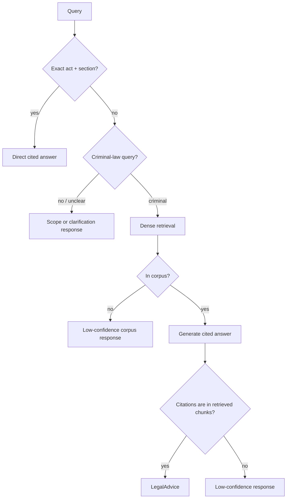

# ⚖️ Agentic Legal RAG: Indian Criminal Law (BNS / BNSS / BSA)

> A legal RAG system for Indian criminal law. The live path uses dense retrieval and deterministic citation validation; the older self-correcting graph stays available for evaluation. RAGAS diagnostics and a BhashaBench-Legal comparison are recorded with their actual models and samples.

> ⚠️ Statutory information, not legal advice. Not a substitute for a lawyer.

> 🚧 **Status:** the simplified live path, API, and Streamlit client are complete. The 12-node graph is retained as an experiment. Docker packaging is deliberately deferred; see Local setup for the currently supported path. See `NOTES.md` for locked decisions and `PROJECT.md` for the build plan.

---

## Why this exists

Indian legal RAG is a crowded niche (LexGrid, NYAYA.ai, Legal Assist AI, BNS Mitra, and others). This project focuses on a smaller path that can be checked: statute-aware dense retrieval, direct section lookup, citation validation, and documented evaluation. The older agent loop remains useful as a comparison, not as a default.

The 2023 to 2024 IPC/BNS transition also created a live pain point: generalist LLMs still cite *repealed* IPC sections. This system carries an IPC-to-BNS mapping and answers in the new code.

## Architecture



The live graph has no rewrite loop. The older full graph with expansion, grading, checking, and
rewriting is still selectable for evaluation.

## Key features

- **Deterministic citation validator:** every cited `[Section, Act]` is verified to exist in the retrieved set (pure code, not an LLM).
- **Exact-section fast path:** `"BNS 103"` / `"302 IPC"` resolve via direct metadata lookup, with IPC references bridged to BNS.
- **Dense retrieval:** the default uses the highest-scoring dense-only setting, with no reranker.
- **Experimental full graph:** intent expansion, grading, checking, and rewriting remain available for reproducible comparisons.
- **Auditable by design:** answers carry structured citations and can include a LangSmith trace URL when tracing is configured.

## Competitor comparison

The comparison below summarizes the systems reviewed during project scoping. Reported
metrics use each project's own setup, so they are context rather than a leaderboard.

| System | Retrieval and agent loop | Grounding check | Reported evaluation |
|---|---|---|---|
| **This project** | Dense live path; legacy LangGraph rewrite loop for comparison | Deterministic cited-section membership check | 50-scenario retrieval set; two full RAGAS-50 runs; 60-question BhashaBench-Legal sample |
| **LexGrid** | Hybrid ANN + full-text RRF, reranking, exact-section bypass; single-shot | Citation format and distance threshold | 12-case suite: MRR 0.833, Recall@5 0.814, P@5 0.233, legal accuracy 0.703 |
| **Legal Assist AI** | Dense FAISS retrieval with a prompt-based guardrail; single-shot | “I don't know” guardrail | AIBE 60.08%; BERTScore 76.9% |
| **Indian Criminal Law RAG Agent** | Dense top-5 retrieval with a three-agent CrewAI loop | LLM grounding assessment | 20-query human evaluation: 85–90% top-5 relevance, 92% grounding |

The intended difference is not that any single component is novel. It is the combination of
statute-aware retrieval, deterministic citation validation, and reported failure cases.

## Evaluation

Every number below is labeled with the model that produced it. Historical runs stay labeled
with their actual model; current development and future runs use DeepSeek. Auditability is a
first-class goal here, so the eval record stays honest about provenance.

### Retrieval (pure, model-agnostic — no LLM)

Current post-repair baseline over the 50-scenario labeled set (`data/eval/scenarios.jsonl`,
19 easy / 24 medium / 7 hard, 66 distinct BNS sections; every labeled section verified to
exist in the corpus before it enters the set). Both rows use the rebuilt 1,151-chunk corpus:

| config | P@5 | Recall@5 | MRR |
|---|---|---|---|
| BM25 only | 0.080 | 0.330 | 0.327 |
| dense only | **0.200** | **0.750** | **0.706** |
| hybrid RRF | 0.132 | 0.527 | 0.508 |
| dense + reranker | 0.176 | 0.693 | 0.456 |
| hybrid + reranker (current agent) | 0.164 | 0.630 | 0.422 |

The rebuilt corpus changes the original hybrid story: dense-only wins this retrieval-only set,
and dense + reranker also beats the hybrid + reranker row. The node-level ablation and manual
audit below support dense without reranking as the live path. (P@5 is low by construction because most
scenarios have one to three relevant sections, capping a perfect single-answer at 0.20.)

### RAGAS (real generative task: DeepSeek Flash judge / Flash control nodes / Pro generator)

Two complete RAGAS-50 runs use a DeepSeek Flash judge and local BGE-small embeddings. The agent
uses Flash control nodes and a Pro final generator. Both numbers are low enough that this remains
a local demo rather than a legal-answer service.

| historical full-graph retrieval | faithfulness | answer relevancy | context precision | context recall |
|---|---:|---:|---:|---:|
| dense, no reranker | 0.309 | **0.518** | 0.700 | **0.840** |
| hybrid RRF + reranker | **0.314** | 0.386 | **0.709** | 0.732 |

Dense has nearly the same faithfulness as hybrid, but its answer relevancy is 0.132 higher and
its context recall is 0.108 higher. Hybrid gains only 0.005 in faithfulness and 0.010 in context
precision. The 20-case node ablation and ten-answer statute audit then moved the live default to
the plain dense path. See [the complete RAGAS record](docs/ragas-50-results.md).

### MCQ external comparability — BhashaBench-Legal criminal slice (Cerebras `gpt-oss-120b`)

The old AIBE plan was dropped (its honestly-answerable IPC slice was only ~6–15 questions;
see `NOTES.md`). `bharatgenai/BhashaBench-Legal` gives a real slice: 1,825 criminal-law MCQs,
579 citing repealed IPC — so the IPC→BNS bridge gets a proper external validation set. On a
stratified 60-question sample (29 bridge-inclusive) vs a no-RAG baseline:

| tier | accuracy |
|---|---|
| system (RAG) | 0.717 |
| no-RAG baseline | 0.683 |
| bridge subset (29 Qs) | 0.724 vs 0.690 baseline |

**Directional only, within noise** (n=60; the overall +0.033 is ~2 questions, the bridge
+0.034 is one). It shows naive retrieve-then-pick isn't hurting on this model/sample — not a
significance claim. This is the naive MCQ path, not the full agent. Not cross-compared to any
other model's number (different model/sample would make the comparison dishonest).

### Ablations

All dense, sparse, hybrid, and reranked retrieval rows are quantified above. I also ran a
budget-limited node ablation on the same stratified random 20-scenario sample. It used dense
retrieval without reranking, DeepSeek V4 Flash for control and judging, and V4 Pro for answers.

| pipeline | faithfulness | answer relevancy | context precision | context recall |
|---|---:|---:|---:|---:|
| baseline | **0.433** | **0.718** | 0.737 | 0.796 |
| baseline + grader | 0.426 | 0.714 | **0.844** | 0.823 |
| baseline + grader + checker | 0.186 | 0.310 | 0.789 | 0.794 |
| current full graph | 0.341 | 0.501 | 0.778 | **0.892** |

The simple baseline is the preferred production candidate. The grader improves context quality,
but its answer-level change is small and it costs eight extra Flash calls. The checker and rewrite
loop add recall but reduce answer grounding and relevance on this sample. This is a 20-case
diagnostic, not a new headline score. The ten-answer statute audit found five generic
low-confidence replies from the full graph after it rejected citation-valid answers. The simple
path had five fully supported answers and five partial answers; one partial answer misstated a
sentence. A regression test now covers the relevant source text and prompt rule. See
[the complete RAGAS record](docs/ragas-50-results.md) and
[the manual answer audit](docs/manual-answer-audit.md).

### A failure handled safely

The citation validator has a deterministic regression test for a high-risk failure: an answer
citing BNS 307 when only BNS 306 was retrieved is rejected before it can be returned. The graph
then rewrites and retrieves again, or returns low confidence once the two-attempt budget is used.

## Local setup

Docker packaging is deferred. Put the source PDFs named in Data & licensing under `data/raw/`;
the local command below regenerates the git-ignored corpus artifacts under `data/processed/`.

```bash
cp .env.example .env        # fill in DEEPSEEK_API_KEY, LANGSMITH_API_KEY, HF_TOKEN
uv sync --all-extras
uv run python -m src.retrieval.index
uv run uvicorn src.api.main:app --reload
# in another terminal:
uv run streamlit run frontend/app.py
```

API: `http://localhost:8000` · Frontend: `http://localhost:8501`

## Current limitations

- Docker packaging is deferred.
- RAGAS-50 found low faithfulness and answer relevancy, so this remains a local demo rather
  than a legal-advice service.

## Data & licensing

- **Corpus:** BNS / BNSS / BSA bare-act PDFs in `data/raw/` (not committed — Govt-of-India copyright, ingested for retrieval/eval, not redistributed). Source the enacted acts from **[India Code](https://indiacode.nic.in)** (the official portal): Bharatiya Nyaya Sanhita 2023 (Act 45, **358 sections**), Bharatiya Nagarik Suraksha Sanhita 2023 (Act 46, **531 sections**), Bharatiya Sakshya Adhiniyam 2023 (Act 47, **170 sections**). Save them as `bns.pdf`, `bnss.pdf`, `bsa.pdf`. The parser verifies the parsed section count against these published totals (all land exact). The **IPC→BNS / CrPC→BNSS / Evidence→BSA** correspondence tables (for the old-code bridge) come from the MHA "three new criminal laws" comparison summaries — save the BNS↔IPC one as `COMPARISON SUMMARY BNS to IPC .pdf`. cognizable/bailable flags are parsed from the BNSS First Schedule.
- **Eval dataset** (gated, needs `HF_TOKEN`):
  - `bharatgenai/BhashaBench-Legal`: **CC BY-4.0**, the criminal-law slice (1,825 MCQs) used for external comparability. (An earlier plan to use `opennyaiorg/aibe_dataset` was dropped — its honestly-answerable IPC slice was too thin to headline; see `NOTES.md`.)

## Governance & security

- **Auditable by design:** structured citations, with LangSmith trace links when tracing is configured.
- ⚠️ **No auth on the API.** Fine for a local demo, but it must sit behind an API key/gateway before any public/cloud deploy.

## Project layout

See `NOTES.md` for the annotated tree and the coding rules.

## Further reading

- [Why naive RAG fails on Indian criminal-law text](docs/why-naive-rag-fails.md)

## License

MIT (code). Eval datasets retain their own licenses (see above).
